# DATA_MODEL.md — RA Assessment App

**Versión del documento**: 1.2  
**Fecha**: 2026-06-07  
**Referencia PRD**: v2.4 — jerarquía institucional, mapeo 2025-2, F05/F08b/F10  
**Audiencia**: Desarrolladores backend, DBAs

> Un DBA que lea este documento puede crear el schema completo de la base de datos sin necesidad de leer el PRD.

---

## 1. Motor y Configuración

- **Motor**: PostgreSQL 16 (LTS hasta 2028)
- **Acceso**: solo desde `localhost:5432` — nunca expuesto a red externa
- **Encoding**: UTF-8
- **ORM**: SQLAlchemy 2.x async (sin SQL crudo)
- **Migraciones**: Alembic (archivos en `alembic/versions/`)

---

## 2. Diagrama Entidad-Relación

```mermaid
erDiagram
    users {
        int id PK
        varchar full_name
        varchar email UK
        varchar hashed_password
        varchar role
        varchar auth_provider
        varchar microsoft_oid UK
        varchar pege_id
        bool is_active
        timestamptz created_at
    }

    student_outcomes {
        int id PK
        varchar code UK
        text description
        bool is_active
    }

    periods {
        int id PK
        varchar name UK
        int student_outcome_id FK
        int rubric_id FK
        date start_date
        date end_date
        varchar status
        int created_by FK
        timestamptz created_at
    }

    rubrics {
        int id PK
        int student_outcome_id FK
        int period_id FK
        int cloned_from FK
        timestamptz created_at
    }

    perf_indicators {
        int id PK
        int rubric_id FK
        varchar code
        text description
        numeric pi_weight
        bool is_active
        int position
    }

    pi_levels {
        int id PK
        int perf_indicator_id FK
        int level_value
        varchar label
        text descriptor
    }

    level_thresholds {
        int id PK
        int rubric_id FK
        numeric poor_max
        numeric inadequate_max
        numeric adequate_max
    }

    modules {
        int id PK
        int period_id FK
        varchar course_code
        varchar course_name
        varchar group_name
        varchar status
        timestamptz submitted_at
    }

    module_staff {
        int id PK
        int module_id FK
        int user_id FK
    }

    students {
        int id PK
        varchar internal_id UK
        varchar document_number
        varchar full_name
        bool is_suppressed
    }

    module_students {
        int id PK
        int module_id FK
        int student_id FK
        varchar status
    }

    student_exclusions {
        int id PK
        int module_student_id FK
        varchar reason_code
        text reason_text
        int excluded_by FK
        timestamptz excluded_at
    }

    assessments {
        int id PK
        int module_student_id FK
        int perf_indicator_id FK
        int level
        timestamptz recorded_at
        timestamptz updated_at
    }

    module_analysis {
        int id PK
        int module_id FK
        int perf_indicator_id FK
        text analysis_text
        timestamptz saved_at
        timestamptz updated_at
    }

    leader_analysis {
        int id PK
        int period_id FK
        int perf_indicator_id FK
        text analysis_text
        int updated_by FK
        timestamptz updated_at
    }

    action_plans {
        int id PK
        int period_id FK
        int perf_indicator_id FK
        varchar action_type
        text description
        varchar responsible
        varchar estimated_date
        bool implemented
        int updated_by FK
        timestamptz updated_at
    }

    reports {
        int id PK
        int period_id FK
        varchar format
        varchar filename
        int generated_by FK
        timestamptz generated_at
    }

    revoked_tokens {
        uuid jti PK
        timestamptz expires_at
    }

    security_events {
        bigint id PK
        timestamptz ts
        varchar event
        int user_id FK
        inet ip
        varchar severity
        jsonb detail
    }

    reminder_log {
        int id PK
        int period_id FK
        int sent_by FK
        jsonb recipient_ids
        text message_body
        timestamptz sent_at
    }

    leader_report_drafts {
        int id PK
        int period_id UK
        jsonb pi_conclusions
        timestamptz last_updated
        int updated_by FK
    }

    oracle_sync_log {
        int id PK
        timestamptz ts
        varchar source
        varchar periodo_codigo
        int docentes_count
        int modulos_count
        int estudiantes_count
        int admin_id FK
        jsonb detail
    }

    users ||--o{ oracle_sync_log : "ejecuta sync"
    users ||--o{ module_staff : "asignado como evaluador"
    users ||--o{ student_exclusions : "excluye estudiante"
    users ||--o{ leader_analysis : "escribe análisis"
    users ||--o{ action_plans : "registra plan"
    users ||--o{ reports : "genera reporte"
    users ||--o{ reminder_log : "envía recordatorio"
    users ||--o{ leader_report_drafts : "actualiza borrador"
    users ||--o{ security_events : "genera evento"
    users ||--o{ periods : "crea período"

    student_outcomes ||--o{ periods : "evaluado en"
    student_outcomes ||--o{ rubrics : "tiene rúbrica"

    periods ||--o{ modules : "contiene"
    periods ||--o{ leader_analysis : "tiene análisis del líder"
    periods ||--o{ action_plans : "tiene planes de acción"
    periods ||--o{ reports : "genera reportes"
    periods ||--o{ reminder_log : "tiene recordatorios"
    periods ||--|| leader_report_drafts : "tiene borrador del líder"
    periods ||--|| rubrics : "usa rúbrica"

    rubrics ||--o{ perf_indicators : "tiene PIs"
    rubrics ||--|| level_thresholds : "tiene umbrales"
    rubrics ||--o{ rubrics : "clonada de"

    perf_indicators ||--o{ pi_levels : "tiene niveles"
    perf_indicators ||--o{ assessments : "calificada en"
    perf_indicators ||--o{ module_analysis : "analizada en"
    perf_indicators ||--o{ leader_analysis : "sintetizada en"
    perf_indicators ||--o{ action_plans : "tiene plan de acción"

    modules ||--o{ module_staff : "tiene evaluador(es)"
    modules ||--o{ module_students : "tiene estudiantes"
    modules ||--o{ module_analysis : "tiene análisis cualitativo"

    students ||--o{ module_students : "matriculado en"

    module_students ||--o{ assessments : "calificado por PI"
    module_students ||--o{ student_exclusions : "puede ser excluido"
```



---

## 2.1 Modelo institucional de medición (PRD v2.4)

Un **cuatrimestre académico** (ej. `2025-2`) es el contenedor del ciclo. El archivo `MODULOS {cuatrimestre} POR RESULTADOS DE APRENDIZAJE.xlsx` define:

- Programas y módulos que aportan evidencia a cada **RA medido**
- Docente calificador por módulo
- **Líder consolidador** por combinación **programa × RA** (persona distinta por RA)

Jerarquía de informes:

```
measurement_cycles (2025-2)
  └── ra_consolidator_assignments (programa × RA → users.id líder)
  └── periods (captura por RA, FK cycle_id)
        └── module_ra_evaluations (módulo físico × período; status/submit)
              └── module_analysis (análisis docente por PI)
        └── modules (módulo físico: cycle_id + program_id + código + grupo)
              └── module_staff / module_students / assessments
        └── leader_analysis / action_plans / leader_report_drafts (programa × período × PI)
  └── [F17] informe ejecutivo por línea propedéutica (admin)
```

**Módulos multi-RA:** un mismo **módulo físico** (`modules`) puede tener varias filas en `module_ra_evaluations` (una por RA medido). El wizard usa `evaluation_id`; `status` y `submitted_at` viven en la evaluación, no en el módulo físico.

**Correo institucional:** `users.email` debe ser `@unibarranquilla.edu.co`, sincronizado con `auth.users.email` (login, recuperación de contraseña, `mailto:` al líder).

**Script de carga:** `scripts/seed_consolidators_from_mapping.py` lee `reviews/mapping_2025-2_analysis.json`.

---

## 3. Tablas — Definición Completa

### 3.1 `users`

Docentes, líderes y administradores del sistema.

| Columna | Tipo PostgreSQL | Nulo | Default | Descripción |
|---|---|---|---|---|
| `id` | `SERIAL` | No | auto | PK |
| `full_name` | `VARCHAR(200)` | No | — | Nombre completo del usuario |
| `email` | `VARCHAR(254)` | No | — | Correo institucional **único** `@unibarranquilla.edu.co`; canónico para login, `resetPasswordForEmail`, `mailto:` al líder consolidador; debe coincidir con `auth.users.email` |
| `hashed_password` | `VARCHAR(100)` | Sí | `NULL` | bcrypt hash; NULL si `auth_provider='microsoft'` |
| `role` | `VARCHAR(20)` | No | — | `'admin'` \| `'leader'` \| `'teacher'` |
| `auth_provider` | `VARCHAR(20)` | No | `'local'` | `'local'` \| `'microsoft'` |
| `microsoft_oid` | `VARCHAR(255)` | Sí | `NULL` | Object ID de Azure AD (unique, nullable) |
| `pege_id` | `VARCHAR(50)` | Sí | `NULL` | ID del docente en el SIS Academusoft; usado por `oracle_adapter.py` para el mapeo de sincronización (F16) |
| `is_active` | `BOOLEAN` | No | `TRUE` | Soft-disable de cuenta |
| `created_at` | `TIMESTAMPTZ` | No | `NOW()` | Timestamp de creación |

**Índices**: `UNIQUE(email)`, `UNIQUE(microsoft_oid)` (partial: WHERE microsoft_oid IS NOT NULL), `UNIQUE(pege_id)` (partial: WHERE pege_id IS NOT NULL)

---

### 3.2 `student_outcomes`

Resultados de Aprendizaje / Student Outcomes del programa (RA1–RA7, SO6, SO7, etc.).

| Columna | Tipo | Nulo | Descripción |
|---|---|---|---|
| `id` | `SERIAL` | No | PK |
| `code` | `VARCHAR(20)` | No | Código único, ej. `'RA1'`, `'SO6'` |
| `description` | `TEXT` | No | Descripción completa del SO/RA |
| `is_active` | `BOOLEAN` | No | Ocultar SOs obsoletos |
| `program_id` | `INT` | Sí | FK → `programs.id` (NULL en v1 TGA; poblado en v2 multi-programa) |

**Índices**: `UNIQUE(code)`, `INDEX(program_id)`

> **Nota v1→v2**: `program_id` es nullable en v1. Al desplegar TGA, todos los SOs existentes se asignan a `programs.id = 1` (TGA) mediante migración de datos en v2.

---

### 3.2a `measurement_cycles`

Cuatrimestre académico de medición (ej. `2025-2`). Un archivo de mapeo Excel corresponde a un ciclo.

| Columna | Tipo | Nulo | Descripción |
|---|---|---|---|
| `id` | `BIGINT` | No | PK |
| `code` | `VARCHAR(20)` | No | Código único, ej. `'2025-2'` |
| `name` | `VARCHAR(100)` | No | Etiqueta legible |
| `status` | `VARCHAR(20)` | No | `'draft'` \| `'open'` \| `'closed'` |

**Índices**: `UNIQUE(code)`

---

### 3.2b `ra_consolidator_assignments`

Asignación de líder consolidador por **ciclo × programa × RA** (desde mapeo Excel).

| Columna | Tipo | Nulo | Descripción |
|---|---|---|---|
| `id` | `BIGINT` | No | PK |
| `cycle_id` | `BIGINT` | No | FK → `measurement_cycles.id` |
| `program_id` | `BIGINT` | No | FK → `programs.id` |
| `student_outcome_id` | `BIGINT` | No | FK → `student_outcomes.id` (RA medido) |
| `consolidator_user_id` | `UUID` | No | FK → `users.id` (líder consolidador) |

**Índices**: `UNIQUE(cycle_id, program_id, student_outcome_id)`

---

### 3.3 `periods`

Período de captura por RA dentro de un ciclo (ej. "2025-2 RA3"). Un período evalúa un SO/RA con una rúbrica específica.

| Columna | Tipo | Nulo | Default | Descripción |
|---|---|---|---|---|
| `id` | `SERIAL` | No | auto | PK |
| `name` | `VARCHAR(100)` | No | — | Nombre único, ej. `'TGA RA1 2024-2'` |
| `student_outcome_id` | `INT` | No | — | FK → `student_outcomes.id` |
| `rubric_id` | `INT` | Sí | `NULL` | FK → `rubrics.id` (NULL hasta que el líder configura la rúbrica) |
| `start_date` | `DATE` | No | — | Fecha de apertura de captura |
| `end_date` | `DATE` | No | — | Fecha de cierre planificado |
| `status` | `VARCHAR(20)` | No | `'draft'` | `'draft'` \| `'open'` \| `'closed'` |
| `created_by` | `INT` | No | — | FK → `users.id` |
| `created_at` | `TIMESTAMPTZ` | No | `NOW()` | Timestamp de creación |
| `cycle_id` | `BIGINT` | Sí | `NULL` | FK → `measurement_cycles.id` (cuatrimestre, ej. `2025-2`) |

**Índices**: `UNIQUE(name)`, `INDEX(student_outcome_id)`, `INDEX(status)`, `INDEX(cycle_id)`

---

### 3.4 `rubrics`

Versión de rúbrica para un SO en un período. Se versiona por período y puede clonarse del anterior.

| Columna | Tipo | Nulo | Descripción |
|---|---|---|---|
| `id` | `SERIAL` | No | PK |
| `student_outcome_id` | `INT` | No | FK → `student_outcomes.id` |
| `period_id` | `INT` | No | FK → `periods.id` |
| `cloned_from` | `INT` | Sí | FK → `rubrics.id` (NULL si es la primera del SO) |
| `created_at` | `TIMESTAMPTZ` | No | `NOW()` |

---

### 3.5 `perf_indicators`

Performance Indicators (PIs) de una rúbrica. Hasta 15 PIs activos por SO.

| Columna | Tipo | Nulo | Default | Descripción |
|---|---|---|---|---|
| `id` | `SERIAL` | No | auto | PK |
| `rubric_id` | `INT` | No | — | FK → `rubrics.id` |
| `code` | `VARCHAR(10)` | No | — | Ej. `'PI1'`, `'PI2'` |
| `description` | `TEXT` | No | — | Descripción del indicador |
| `pi_weight` | `NUMERIC(5,2)` | No | `0` | Peso porcentual (0.00–100.00). **Suma de activos debe ser exactamente 100.00** |
| `is_active` | `BOOLEAN` | No | `TRUE` | PI desactivado → peso 0, excluido del cálculo |
| `position` | `INT` | No | — | Orden de presentación (1–15) |

**Índices**: `INDEX(rubric_id)`, `UNIQUE(rubric_id, code)`  
**Constraint de negocio** (enforced en Pydantic, no en DB): `SUM(pi_weight) WHERE is_active = TRUE = 100.00`

**Origen Excel**: columnas J12/M12/P12/S12/V12/Y12 de la hoja `EF_ASESSM_SO_GENERIC`

---

### 3.6 `pi_levels`

Descriptores de los 4 niveles de desempeño para cada PI.

| Columna | Tipo | Nulo | Descripción |
|---|---|---|---|
| `id` | `SERIAL` | No | PK |
| `perf_indicator_id` | `INT` | No | FK → `perf_indicators.id` |
| `level_value` | `INT` | No | `1`=Poor, `2`=Inadequate, `4`=Adequate, `5`=Exemplary. **CHECK** `IN (1,2,4,5)` |
| `label` | `VARCHAR(20)` | No | `'Poor'` \| `'Inadequate'` \| `'Adequate'` \| `'Exemplary'` |
| `descriptor` | `TEXT` | No | Descripción del desempeño esperado en este nivel |

**Índices**: `UNIQUE(perf_indicator_id, level_value)`

---

### 3.7 `level_thresholds`

Umbrales de corte score → Standard por rúbrica. Configurables por el líder; defaults mapeados de la hoja `Conversion` del Excel.

| Columna | Tipo | Nulo | Default | Descripción |
|---|---|---|---|---|
| `id` | `SERIAL` | No | auto | PK |
| `rubric_id` | `INT` | No | — | FK → `rubrics.id` (UNIQUE) |
| `poor_max` | `NUMERIC(4,2)` | No | `2.00` | Total Score ≤ poor_max → Standard "Low" |
| `inadequate_max` | `NUMERIC(4,2)` | No | `3.00` | Total Score ≤ inadequate_max → Standard "Medium" (intermedio) |
| `adequate_max` | `NUMERIC(4,2)` | No | `4.00` | Total Score ≤ adequate_max → Standard "Medium" |

**Nota**: Total Score > `adequate_max` → Standard "High". Origen: `RUBRIC!$I$6–$I$8` del Excel.

---

### 3.8 `modules`

Módulo **físico** = instancia curso+grupo en un ciclo de medición. Una fila por `(cycle_id, program_id, course_code, group_name)`.

| Columna | Tipo | Nulo | Default | Descripción |
|---|---|---|---|---|
| `id` | `SERIAL` | No | auto | PK |
| `cycle_id` | `BIGINT` | No | — | FK → `measurement_cycles.id` |
| `program_id` | `BIGINT` | Sí | `NULL` | FK → `programs.id` (programa del mapeo; necesario para resolver líder consolidador) |
| `course_code` | `VARCHAR(30)` | No | — | Código institucional del curso |
| `course_name` | `VARCHAR(200)` | No | — | Nombre del curso |
| `group_name` | `VARCHAR(20)` | No | — | Grupo, ej. `'A'`, `'B'` |

**Índices**: `UNIQUE(cycle_id, COALESCE(program_id,-1), course_code, group_name)`, `INDEX(cycle_id)`

---

### 3.8a `module_ra_evaluations`

Asignación **módulo físico × período de captura (RA)**. Una fila por cada RA que el módulo mide en el ciclo (305 en 2025-2).

| Columna | Tipo | Nulo | Default | Descripción |
|---|---|---|---|---|
| `id` | `BIGINT` | No | auto | PK |
| `module_id` | `BIGINT` | No | — | FK → `modules.id` |
| `period_id` | `BIGINT` | No | — | FK → `periods.id` |
| `status` | `VARCHAR(20)` | No | `'pending'` | `'pending'` \| `'in_progress'` \| `'completed'` |
| `submitted_at` | `TIMESTAMPTZ` | Sí | `NULL` | Timestamp del envío docente para este RA |

**Índices**: `UNIQUE(module_id, period_id)`, `INDEX(period_id)`, `INDEX(period_id, status)`

**Wizard URL**: `assessment.html?evaluation_id={id}`

---

### 3.9 `module_staff`

Asignación de evaluador(es) a un módulo. Normalmente 1 docente por módulo, pero un usuario con rol global `leader` tambien puede aparecer aqui si la administración lo autoriza como evaluador de un módulo de su propio RA/SO o de otro RA/SO. Para escritura de calificaciones, importación de estudiantes, análisis cualitativo de módulo y submit, esta tabla es la autoridad efectiva: `users.role='leader'` no reemplaza la asignación en `module_staff`.

| Columna | Tipo | Descripción |
|---|---|---|
| `id` | `SERIAL` | PK |
| `module_id` | `INT` | FK → `modules.id` |
| `user_id` | `INT` | FK → `users.id` |

**Índices**: `UNIQUE(module_id, user_id)`, `INDEX(user_id)`

**Regla de autorización**: `verify_module_ownership(module_id, current_user)` retorna el módulo solo cuando existe una fila `module_staff(module_id, current_user.id)`. Si no existe, retorna `404 Not Found` aunque el usuario tenga rol `leader`.

---

### 3.10 `students`

Estudiantes del sistema. Un estudiante puede estar en múltiples módulos (distintos períodos).

| Columna | Tipo | Nulo | Descripción |
|---|---|---|---|
| `id` | `SERIAL` | No | PK |
| `internal_id` | `VARCHAR(20)` | No | ID interno del sistema académico (unique); en v1 import PDF = `document_number` (ADR-0002) |
| `document_number` | `VARCHAR(15)` | No | Cédula o TI (unique — clave natural de upsert) |
| `full_name` | `VARCHAR(200)` | No | Apellidos y nombre (sanitizado) |
| `pege_id` | `VARCHAR(50)` | Sí | `NULL` | Persona General Academusoft; lo rellena `oracle_adapter` (ADR-0002) |
| `is_suppressed` | `BOOLEAN` | No | `TRUE` si fue anonimizado vía habeas data |

**Índices**: `UNIQUE(internal_id)`, `UNIQUE(document_number)`, `UNIQUE(pege_id)` (partial: WHERE `pege_id IS NOT NULL`)  
**Nota de privacidad**: en caso de supresión (Ley 1581/2012), `full_name` se actualiza a `'[SUPRIMIDO]'` y `document_number` a `'[SUPRIMIDO-{id}]'`. No se elimina el registro para preservar integridad de reportes cerrados.

---

### 3.11 `module_students`

Relación entre un módulo y sus estudiantes matriculados.

| Columna | Tipo | Nulo | Default | Descripción |
|---|---|---|---|---|
| `id` | `SERIAL` | No | auto | PK |
| `module_id` | `INT` | No | — | FK → `modules.id` |
| `student_id` | `INT` | No | — | FK → `students.id` |
| `roster_position` | `INT` | No | `0` | Orden en lista del módulo (`No.` del PDF Academusoft; ADR-0002) |
| `status` | `VARCHAR(20)` | No | `'active'` | `'active'` \| `'excluded'` |

**Índices**: `UNIQUE(module_id, student_id)`, `INDEX(module_id)`, `INDEX(student_id)`, `INDEX(module_id, roster_position)`

---

### 3.12 `student_exclusions`

Registro de exclusiones de estudiantes de un módulo con motivo documentado (trazabilidad ABET).

| Columna | Tipo | Nulo | Descripción |
|---|---|---|---|
| `id` | `SERIAL` | No | PK |
| `module_student_id` | `INT` | No | FK → `module_students.id` |
| `reason_code` | `VARCHAR(30)` | No | `'withdrew'` \| `'never_attended'` \| `'medical'` \| `'other'` |
| `reason_text` | `TEXT` | Sí | Texto libre si `reason_code='other'` |
| `excluded_by` | `INT` | No | FK → `users.id` |
| `excluded_at` | `TIMESTAMPTZ` | No | Timestamp de exclusión |

---

### 3.13 `assessments`

Calificación de un estudiante en un PI específico. Valor discreto **{1, 2, 4, 5}** (sin decimales; el valor 3 no existe en la escala ABET IUB).

| Columna | Tipo | Nulo | Descripción |
|---|---|---|---|
| `id` | `SERIAL` | No | PK |
| `module_student_id` | `INT` | No | FK → `module_students.id` |
| `perf_indicator_id` | `INT` | No | FK → `perf_indicators.id` |
| `level` | `INT` | No | `1`=Poor, `2`=Inadequate, `4`=Adequate, `5`=Exemplary. **CHECK** `IN (1,2,4,5)` |
| `recorded_at` | `TIMESTAMPTZ` | No | Primer registro |
| `updated_at` | `TIMESTAMPTZ` | No | Última modificación |

**Índices**: `UNIQUE(module_student_id, perf_indicator_id)`, `INDEX(module_student_id)`  
**Nota**: Los campos `pi_percentage`, `total_score` y `standard` son calculados por la API en runtime — no se almacenan en DB. El cálculo es: `pi_percentage = level × pi_weight / 5`; `total_score = SUM(pi_percentage)` (máx. 100); `standard` se deriva de `level_thresholds`.

**Origen Excel**: celdas I/L/O/R/U/X (filas 15–81) de la hoja `EF_ASESSM_SO_GENERIC`

---

### 3.14 `module_analysis`

Análisis cualitativo del **docente** por PI de una **evaluación módulo×RA** (Nivel 1 ABET). Obligatorio para `module_ra_evaluations.status = completed`.

| Columna | Tipo | Nulo | Descripción |
|---|---|---|---|
| `id` | `SERIAL` | No | PK |
| `module_ra_evaluation_id` | `BIGINT` | No | FK → `module_ra_evaluations.id` |
| `perf_indicator_id` | `INT` | No | FK → `perf_indicators.id` |
| `analysis_text` | `TEXT` | No | Texto sanitizado con `bleach.clean()` antes de persistir (max 2000 chars) |
| `saved_at` | `TIMESTAMPTZ` | No | Primer guardado |
| `updated_at` | `TIMESTAMPTZ` | No | Última modificación |

**Índices**: `UNIQUE(module_ra_evaluation_id, perf_indicator_id)`

---

### 3.15 `leader_analysis`

Síntesis del **líder consolidador** por **programa × período × PI** (Nivel 2 ABET). Obligatorio para exportar el reporte del programa.

| Columna | Tipo | Nulo | Descripción |
|---|---|---|---|
| `id` | `SERIAL` | No | PK |
| `period_id` | `INT` | No | FK → `periods.id` |
| `program_id` | `BIGINT` | No | FK → `programs.id` |
| `perf_indicator_id` | `INT` | No | FK → `perf_indicators.id` |
| `analysis_text` | `TEXT` | No | Texto sanitizado con `bleach.clean()` antes de persistir |
| `updated_by` | `INT` | No | FK → `users.id` |
| `updated_at` | `TIMESTAMPTZ` | No | Última modificación |

**Índices**: `UNIQUE(period_id, program_id, perf_indicator_id)`

---

### 3.16 `action_plans`

Plan de acción del líder por **programa × período × PI** ("Closing the Loop" ABET — Sección 4 del reporte).

| Columna | Tipo | Nulo | Default | Descripción |
|---|---|---|---|---|
| `id` | `SERIAL` | No | auto | PK |
| `period_id` | `INT` | No | — | FK → `periods.id` |
| `program_id` | `BIGINT` | No | — | FK → `programs.id` |
| `perf_indicator_id` | `INT` | No | — | FK → `perf_indicators.id` |
| `action_type` | `VARCHAR(20)` | No | — | `'corrective'` \| `'preventive'` \| `'improvement'` |
| `description` | `TEXT` | No | — | Descripción concreta de la acción (max 2000 chars, sanitizado) |
| `responsible` | `VARCHAR(200)` | No | — | Líder, docente específico o programa |
| `estimated_date` | `VARCHAR(20)` | No | — | Ej. `'2025-01'` (cuatrimestre) |
| `implemented` | `BOOLEAN` | No | `FALSE` | Marcado como implementado en el siguiente ciclo |
| `updated_by` | `INT` | No | — | FK → `users.id` |
| `updated_at` | `TIMESTAMPTZ` | No | — | Última modificación |

**Índices**: `UNIQUE(period_id, program_id, perf_indicator_id)`

---

### 3.17 `reports`

Metadatos de cada reporte ABET exportado (snapshot del estado al momento de exportar).

| Columna | Tipo | Descripción |
|---|---|---|
| `id` | `SERIAL` | PK |
| `period_id` | `INT` | FK → `periods.id` |
| `format` | `VARCHAR(10)` | `'pdf'` \| `'xlsx'` |
| `filename` | `VARCHAR(200)` | Nombre del archivo generado con timestamp |
| `generated_by` | `INT` | FK → `users.id` |
| `generated_at` | `TIMESTAMPTZ` | Timestamp de generación |

---

### 3.18 `revoked_tokens` (tabla de seguridad)

JTIs de tokens JWT revocados al hacer logout. Permite invalidación inmediata de sesiones.

| Columna | Tipo | Descripción |
|---|---|---|
| `jti` | `UUID` | PK — JWT ID del token revocado |
| `expires_at` | `TIMESTAMPTZ` | Expiración original del token (para limpieza periódica) |

**Job periódico**: `DELETE FROM revoked_tokens WHERE expires_at < NOW()` (cron diario o al iniciar el servicio)

---

### 3.19 `security_events` (tabla de seguridad — append-only)

Audit log de todos los eventos de seguridad. Nunca se modifica, solo se inserta.

| Columna | Tipo | Descripción |
|---|---|---|
| `id` | `BIGSERIAL` | PK |
| `ts` | `TIMESTAMPTZ` | Timestamp del evento |
| `event` | `VARCHAR(60)` | Nombre del evento (ver listado completo más abajo) |
| `user_id` | `INT` | FK → `users.id` (nullable — NULL para eventos sin sesión) |
| `ip` | `INET` | IP del cliente |
| `severity` | `VARCHAR(10)` | `'INFO'` \| `'WARN'` \| `'ERROR'` |
| `detail` | `JSONB` | Datos adicionales específicos del evento |

**Índices**: `INDEX(ts)`, `INDEX(event)`, `INDEX(user_id)`

**Eventos registrados**:

| Evento | Cuándo | Datos en `detail` |
|---|---|---|
| `login_success` | Login exitoso | `{user_id}` |
| `login_failed` | Credenciales incorrectas | `{email_attempt}` |
| `login_rate_limited` | IP supera 5/min | — |
| `access_denied` | 403 en cualquier endpoint | `{endpoint}` |
| `period_closed` | Líder cierra período | `{period_id}` |
| `report_exported` | Descarga PDF o xlsx (F07) | `{period_id, format}` |
| `student_imported` | Import CSV exitoso (F03) | `{module_id, count}` |
| `password_changed` | Cambio de contraseña | — |
| `habeas_data_accessed` | Consulta habeas data | `{doc_hash_partial}` |
| `oidc_login_success` | Login Microsoft exitoso | — |
| `oidc_login_failed` | Fallo validación id_token | `{reason}` |
| `oidc_account_not_registered` | Usuario Microsoft sin rol | `{oid_hash}` |
| `reminder_sent` | Líder envía recordatorios (F13) | `{period_id, recipient_ids, count}` |
| `leader_report_generated` | Descarga informe líder (F14) | `{period_id, format}` |
| `bulk_import_rubrics` | Import masivo rúbricas (F15) | `{count}` |
| `bulk_import_users` | Import masivo usuarios (F15) | `{count}` |
| `bulk_import_modules` | Import masivo módulos (F15) | `{period_id, count}` |
| `bulk_import_students` | Import masivo estudiantes (F15) | `{module_id, count, consent}` |

---

### 3.20 `reminder_log` (nueva en v2.1)

Historial de recordatorios enviados por el líder a docentes pendientes (F13).

| Columna | Tipo | Descripción |
|---|---|---|
| `id` | `SERIAL` | PK |
| `period_id` | `INT` | FK → `periods.id` |
| `sent_by` | `INT` | FK → `users.id` |
| `recipient_ids` | `JSONB` | Lista de `user_id` de destinatarios (IDs internos, no emails) |
| `message_body` | `TEXT` | Texto del mensaje enviado (con variables sin resolver) |
| `sent_at` | `TIMESTAMPTZ` | `DEFAULT NOW()` |

---

### 3.21 `leader_report_drafts`

Borradores de conclusiones del líder por **programa × período × PI** para el informe F14.

| Columna | Tipo | Nulo | Descripción |
|---|---|---|---|
| `id` | `SERIAL` | No | PK |
| `period_id` | `INT` | No | FK → `periods.id` |
| `program_id` | `BIGINT` | No | FK → `programs.id` |
| `perf_indicator_id` | `INT` | No | FK → `perf_indicators.id` |
| `conclusion_text` | `TEXT` | No | Conclusión del líder (max 3000 chars) |
| `updated_at` | `TIMESTAMPTZ` | No | `DEFAULT NOW()` |
| `updated_by` | `INT` | No | FK → `users.id` |

**Índices**: `UNIQUE(period_id, program_id, perf_indicator_id)`

---

### 3.22 `oracle_sync_log` (nueva en F16)

Auditoría de todas las sincronizaciones ejecutadas por `SyncService`, independientemente de la fuente (`file_adapter`, `oracle_adapter`, `rest_adapter`).

| Columna | Tipo | Nulo | Descripción |
|---|---|---|---|
| `id` | `SERIAL` | No | PK |
| `ts` | `TIMESTAMPTZ` | No | `DEFAULT NOW()` — timestamp de la sincronización |
| `source` | `VARCHAR(30)` | No | Fuente: `'csv'` \| `'academusoft'` \| `'rest'` \| `'manual'` |
| `periodo_codigo` | `VARCHAR(50)` | No | Código del período sincronizado |
| `docentes_count` | `INT` | No | Número de docentes procesados (nuevos + actualizados) |
| `modulos_count` | `INT` | No | Número de módulos procesados |
| `estudiantes_count` | `INT` | No | Número de estudiantes procesados |
| `admin_id` | `INT` | No | FK → `users.id` — quién ejecutó la sincronización |
| `detail` | `JSONB` | Sí | Errores o advertencias del proceso (filas rechazadas, etc.) |

**Índices**: `INDEX(ts)`, `INDEX(source)`, `INDEX(admin_id)`

> **Trazabilidad Ley 1581/2012**: el campo `source` permite responder ante una solicitud habeas data de qué sistema provienen los datos del titular — si del CSV manual con consentimiento explícito del Admin, o de la sincronización directa con Oracle validada jurídicamente.

---

### 3.23 `propedeutic_lines` (nueva en F17 — v2)

Líneas propedéuticas institucionales de la IUB. Agrupan programas de formación por continuidad curricular entre ciclos (Técnico → Tecnológico → Profesional).

| Columna | Tipo | Nulo | Descripción |
|---|---|---|---|
| `id` | `SERIAL` | No | PK |
| `name` | `VARCHAR(200)` | No | Nombre descriptivo, ej. `'Gestión Administrativa'` |
| `code` | `VARCHAR(20)` | No | Código corto único, ej. `'LP-GESTION'`, `'LP-INFORMATICA'` |
| `is_active` | `BOOLEAN` | No | `DEFAULT TRUE` — permite ocultar líneas discontinuadas |

**Índices**: `UNIQUE(code)`

**Datos semilla confirmados (v2):**

| code | name |
|---|---|
| `LP-INFORMATICA` | Informática y Telecomunicaciones |
| `LP-GESTION` | Gestión Administrativa |

> **Alcance**: institucional completo (no limitado a la FCCEA). La línea propedéutica agrupa programas de distintas facultades si comparten continuidad curricular reconocida por el MEN.

---

### 3.24 `programs` (nueva en F17 — v2)

Programas académicos de la IUB. Cada programa pertenece a una línea propedéutica y a un ciclo de formación.

| Columna | Tipo | Nulo | Descripción |
|---|---|---|---|
| `id` | `SERIAL` | No | PK |
| `propedeutic_line_id` | `INT` | No | FK → `propedeutic_lines.id` |
| `name` | `VARCHAR(200)` | No | Nombre oficial del programa, ej. `'Tecnología en Gestión Administrativa'` |
| `code` | `VARCHAR(30)` | No | Código único, ej. `'TGA'`, `'TGLI'`, `'ING-TELEMATICA'` |
| `cycle_level` | `VARCHAR(20)` | No | `'tecnico'` \| `'tecnologico'` \| `'profesional'` |
| `faculty` | `VARCHAR(200)` | Sí | Facultad a la que pertenece el programa |
| `is_active` | `BOOLEAN` | No | `DEFAULT TRUE` |

**Índices**: `UNIQUE(code)`, `INDEX(propedeutic_line_id)`, `INDEX(cycle_level)`

**Datos semilla confirmados (v2):**

| code | name | cycle_level | propedeutic_line |
|---|---|---|---|
| `TGA` | Tecnología en Gestión Administrativa | `tecnologico` | LP-GESTION |
| `ING-NEGOCIOS` | Inteligencia de Negocios | `profesional` | LP-GESTION |
| `TEC-TELECOM` | Técnico en Telecomunicaciones | `tecnico` | LP-INFORMATICA |
| `TGLI` | Tecnología en Telemática | `tecnologico` | LP-INFORMATICA |
| `ING-TELEMATICA` | Ingeniería Telemática | `profesional` | LP-INFORMATICA |

> **Relación con `student_outcomes`**: cada SO/RA pertenece a un programa (`program_id` FK en `student_outcomes`). En v1, todos los SOs son del programa TGA; el campo es nullable hasta la migración de datos v2.

---

## 4. Índices Recomendados (resumen)

```sql
-- Performance queries frecuentes
CREATE INDEX idx_assessments_module_student ON assessments(module_student_id);
CREATE INDEX idx_module_students_module ON module_students(module_id);
CREATE INDEX idx_module_analysis_module ON module_analysis(module_id);
CREATE INDEX idx_security_events_ts ON security_events(ts);
CREATE INDEX idx_security_events_event ON security_events(event);
CREATE INDEX idx_modules_period_status ON modules(period_id, status);
CREATE INDEX idx_revoked_tokens_expires ON revoked_tokens(expires_at);

-- Partial index para microsoft_oid (solo usuarios con cuenta Microsoft)
CREATE UNIQUE INDEX idx_users_microsoft_oid
  ON users(microsoft_oid)
  WHERE microsoft_oid IS NOT NULL;
```

---

## 5. Reglas de Negocio Enforced en la API (no en DB)

Las siguientes reglas NO se implementan como constraints de DB para preservar flexibilidad de migración, pero **SÍ se enforcan en validadores Pydantic** y son bloqueantes:

1. **Suma de pesos de PIs = 100%**: `SUM(pi_weight) WHERE is_active = TRUE` debe ser exactamente 100.00 al guardar una rúbrica.
2. **Completitud de módulo**: todos los `module_students` con `status='active'` deben tener una fila en `assessments` para cada PI activo antes de permitir `PUT /modules/{id}/submit`.
3. **Análisis obligatorio**: todas las filas de `module_analysis` para PIs con al menos 1 calificación deben tener `analysis_text` no vacío antes del submit.
4. **Ownership en importaciones (F15)**: `consent_acknowledged: true` es obligatorio en el body del endpoint `POST /admin/bulk/students`.

---

## 6. Política de Retención y Privacidad

- Los datos de períodos cerrados se **conservan indefinidamente** (requerimiento ABET de trazabilidad)
- La supresión de datos personales (Ley 1581/2012) se implementa como **anonimización**, no eliminación física:
  ```sql
  UPDATE students
  SET full_name = '[SUPRIMIDO]',
      document_number = '[SUPRIMIDO-' || id || ']',
      is_suppressed = TRUE
  WHERE id = :student_id;
  ```
- Los backups diarios se cifran con GPG antes de salir del servidor (cedulas y nombres en scope de Ley 1581)
- Ver `SECURITY_PRIVACY.md §5` para el procedimiento completo de habeas data
